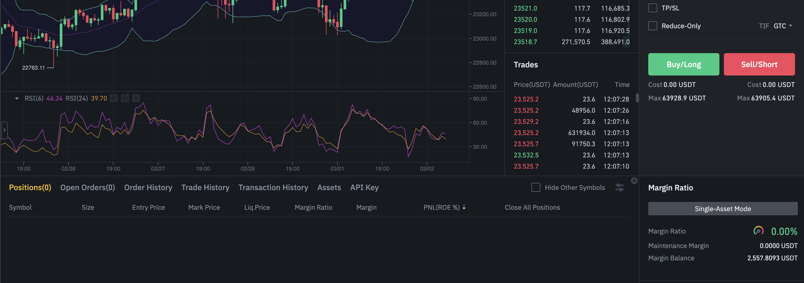

# Create API Keys

## Spot Testnet

[Instruction](https://testnet.binance.vision/)

## Perpeptual Future Testnet

Steps:

- Login main account
- Change to Future site [LINK](https://www.binance.com/en/futures/BTCUSDT)
- Navigate to Mock Trading site 
  - Scroll down then tab on API 

## API

- [NodeJs lib](https://github.com/binance-exchange/node-binance-api)
- [API Key Management](https://www.binance.com/en/my/settings/api-management)
